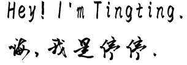

<!--
**titizheng/titizheng** is a ✨ _special_ ✨ repository because its `README.md` (this file) appears on your GitHub profile.
参考的链接是：https://github.com/anuraghazra/github-readme-stats
Here are some ideas to get you started:

- 🔭 I’m currently working on ...
- 🌱 I’m currently learning ...
- 👯 I’m looking to collaborate on ...
- 🤔 I’m looking for help with ...
- 💬 Ask me about ...
- 📫 How to reach me: ...
- 😄 Pronouns: ...
- ⚡ Fun fact: ...
-->

<!--  -->

  
## Hey, 👋  I'm <a href="https://titizheng.github.io/" target="_blank">Tingting Zheng (郑停停)</a> 

<!-- 

 -->

### About me
|  |  |
| ------------- | ------------- |

